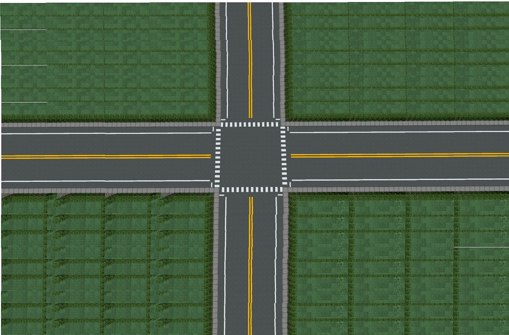

# AI Traffic Management System

[](https://github.com/aaron-seq/AI-ML-Based-traffic-management-system/actions/workflows/ci.yml)
[](LICENSE)
[](https://www.python.org/downloads/)
[](https://react.dev/)

**Traffic signals that respond to the traffic actually there.**

Most junctions still run a fixed timing plan: the same green, whether twenty
cars are waiting or none. This system watches the intersection with a camera,
counts what is queued on each approach, and allocates green time accordingly —
then reports what that was worth in delay, fuel and CO₂.

<p align="center">
  
</p>

---

## Contents

- [What it does](#what-it-does)
- [Quick start](#quick-start)
- [How it works](#how-it-works)
- [Who it is for](#who-it-is-for)
- [API](#api)
- [Configuration](#configuration)
- [Connecting real hardware](#connecting-real-hardware)
- [Deployment](#deployment)
- [Development](#development)
- [Honest limitations](#honest-limitations)
- [Documentation](#documentation)

---

## What it does

### Sees the traffic
- **Images, video and live streams.** Point it at a photo, an uploaded clip or
  an RTSP camera feed.
- **Multi-object tracking**, so the same car across thirty frames counts once —
  which is what makes unique counts, flow rates and speed estimates possible.
- **Capacity-weighted queues.** A bus is not one car; queues are measured in
  passenger-car units so a lane full of buses gets the green time it needs.
- **Pedestrians are counted too**, not just vehicles.

### Controls the signals
- **Adaptive green**, proportional to the measured queue, clamped so one busy
  approach cannot starve the others.
- **A phase state machine that cannot produce conflicting greens.** Right of
  way belongs to a phase, never to individual heads, and every green is
  separated from the conflicting green by yellow and all-red clearance.
- **Emergency pre-emption** — an approaching ambulance gets the green, still
  through a safe clearance sequence.
- **Pedestrian priority with a bounded wait.** A request that has waited too
  long pre-empts vehicle phases outright, rather than being deferred forever
  under heavy traffic.
- **Green-wave coordination** across a corridor, so fixing one junction does not
  simply move the queue to the next one.

### Tells you whether it worked
- **Short-term forecasting** (5–60 minutes) that reports its own confidence and
  says what it needs when history is too thin, rather than extrapolating
  confidently from four data points.
- **Impact modelling**: vehicle-delay saved, fuel not burnt, CO₂ avoided,
  person-hours returned and their monetary value — each published alongside the
  assumptions used to derive it.
- **Prometheus metrics** and **Grafana alerts** for the failure modes that
  matter: a stalled controller, silently failing detection, queues that never
  clear, pedestrians waiting too long.

### Works without a camera
Not every site can run inference, and not every sensor is a camera. Inductive
loops, radar, a microsimulation or a load test can post counts straight to
`POST /api/v1/intersections/{id}/counts` and drive the same controller.

---

## Quick start

### Docker (everything, one command)

```bash
git clone https://github.com/aaron-seq/AI-ML-Based-traffic-management-system.git
cd AI-ML-Based-traffic-management-system
docker compose up -d
```

| | |
|---|---|
| Dashboard | <http://localhost:3000> |
| API docs | <http://localhost:8000/api/docs> |
| Health | <http://localhost:8000/health> |
| Metrics | <http://localhost:8000/metrics> |

The first boot downloads the detection weights (~6 MB for the default model),
so give it a minute before the detector reports ready.

### Local development

**Backend** — Python 3.11 or newer:

```bash
cd backend
python -m venv .venv && source .venv/bin/activate   # Windows: .venv\Scripts\activate

# CPU-only torch is ~200 MB against ~3 GB for the CUDA build.
pip install torch torchvision --index-url https://download.pytorch.org/whl/cpu
pip install -r requirements.txt

uvicorn app.main:app --reload
```

**Frontend** — Node 20.19 or newer:

```bash
cd frontend
npm install
npm run dev          # http://localhost:3000, proxied to the backend
```

### See it work in 30 seconds

```bash
# Analyse a sample intersection photo
curl -X POST http://localhost:8000/api/v1/detection/image \
     -F "image=@test_images/1.jpg" | jq '{total_vehicles, lane_counts, busiest_lane}'

# Watch the signals respond to what was detected
curl -s http://localhost:8000/api/v1/intersections/main_intersection \
  | jq '{current_phase, green_direction, vehicle_counts}'

# Send an ambulance through
curl -X POST http://localhost:8000/api/v1/emergency/override \
     -H 'Content-Type: application/json' \
     -d '{"emergency_type":"ambulance","detected_lane":"north","priority_level":5}'
```

No camera? Drive it directly:

```bash
curl -X POST http://localhost:8000/api/v1/intersections/main_intersection/counts \
     -H 'Content-Type: application/json' \
     -d '{"counts":{"north":18,"south":3,"east":2,"west":1}}'
```

---

## How it works

```
   camera / video / stream            loops, radar, simulator
             │                                  │
             ▼                                  │
   ┌───────────────────┐                        │
   │  YOLO detection   │  per-frame boxes       │
   │  + ByteTrack      │  → tracked objects     │
   └─────────┬─────────┘                        │
             │  queue per approach, in PCU      │
             ▼                                  ▼
   ┌──────────────────────────────────────────────────┐
   │            Adaptive signal controller            │
   │                                                  │
   │   NS green → NS yellow → all-red →               │
   │   EW green → EW yellow → all-red → ⟳              │
   │                                                  │
   │   pedestrian and emergency phases are inserted   │
   │   only at all-red boundaries                     │
   └───────┬────────────────────────┬─────────────────┘
           │                        │
           ▼                        ▼
   ┌───────────────┐        ┌────────────────────────┐
   │  Corridor     │        │  Analytics · Forecast  │
   │  green wave   │        │  Impact · Metrics      │
   └───────────────┘        └────────────────────────┘
           │                        │
           ▼                        ▼
   field hardware            dashboard · Prometheus
   (webhook / Arduino)       (WebSocket, live)
```

**Why phases rather than per-signal timers.** The obvious design gives each
signal head its own countdown, but nothing then structurally prevents two
conflicting heads from turning green together — it only works while the
arithmetic happens to line up. Making the *phase* the unit of right of way
means a conflicting green is not merely unlikely, it is unrepresentable. The
test suite asserts this invariant across every transition, pre-emption and
pedestrian interruption.

**Why passenger-car units.** Green time discharges road space, not vehicles. A
queue of ten motorcycles clears far faster than ten buses. Weighting each
detection by its capacity equivalent means the allocated green matches the time
actually needed.

**Why a green wave.** An intersection optimised in isolation can simply hand its
queue to the next junction. Offsetting each intersection's green by
`distance ÷ speed` lets a platoon travel the corridor without stopping.

---

## Who it is for

| You are | What this gives you |
|---|---|
| **A city or transport authority** | Retrofit adaptive control onto existing signals using cameras you may already have, and get delay/fuel/CO₂ figures to support the business case. |
| **A researcher** | An instrumented, tested control loop you can swap algorithms into, with a metrics and persistence layer already in place. |
| **A student or educator** | A complete, working system — computer vision, control theory, real-time web, deployment — that runs on a laptop with no hardware. |
| **A smart-city integrator** | A documented REST + WebSocket API, Prometheus metrics, and a hardware bridge for existing controllers. |
| **An emergency service** | An API to request signal pre-emption along a route from your own dispatch system. |

---

## API

Full interactive documentation at `/api/docs`. Highlights:

| Method | Endpoint | Purpose |
|---|---|---|
| `POST` | `/api/v1/detection/image` | Detect vehicles and pedestrians in a photo |
| `POST` | `/api/v1/detection/video` | Track road users through a clip |
| `POST` | `/api/v1/detection/stream` | Sample a live RTSP/HTTP camera |
| `GET` | `/api/v1/intersections` | List every intersection |
| `GET` | `/api/v1/intersections/{id}` | Live phase, aspects, queues |
| `POST` | `/api/v1/intersections/{id}/counts` | Feed counts from any sensor |
| `PATCH` | `/api/v1/intersections/{id}/plan` | Retune timing without a restart |
| `GET` | `/api/v1/intersections/coordination` | Green-wave offsets |
| `POST` | `/api/v1/emergency/override` | Pre-empt for an emergency vehicle |
| `POST` | `/api/v1/pedestrians/request` | Request a crossing |
| `GET` | `/api/v1/forecast/{id}` | Short-term demand forecast |
| `GET` | `/api/v1/impact/{id}` | Modelled delay, fuel and CO₂ savings |
| `GET` | `/api/v1/analytics/summary` | Traffic and pipeline analytics |
| `WS` | `/ws/traffic-updates` | Live event stream |

Live updates:

```javascript
const socket = new WebSocket('ws://localhost:8000/ws/traffic-updates');
socket.onmessage = ({ data }) => {
  const { type, data: payload } = JSON.parse(data);
  if (type === 'intersection_status') console.log(payload.current_phase);
};
```

See [`docs/api.md`](docs/api.md) for every endpoint and payload.

---

## Configuration

Everything is configured through `TRAFFIC_`-prefixed environment variables, or a
`.env` file. Copy the annotated template:

```bash
cp .env.example backend/.env
```

The settings you are most likely to change:

| Variable | Default | Effect |
|---|---|---|
| `TRAFFIC_MODEL_NAME` | `yolov8n.pt` | Accuracy against speed |
| `TRAFFIC_DETECTION_CONFIDENCE_THRESHOLD` | `0.35` | Lower catches distant vehicles, admits false positives |
| `TRAFFIC_MINIMUM_GREEN_DURATION` | `10` | Floor on green, per phase |
| `TRAFFIC_MAXIMUM_GREEN_DURATION` | `120` | Ceiling, so no approach starves |
| `TRAFFIC_SECONDS_PER_QUEUED_VEHICLE` | `2.0` | How aggressively green follows demand |
| `TRAFFIC_PEDESTRIAN_MAX_WAIT_SECONDS` | `90` | Bound on pedestrian delay |
| `TRAFFIC_API_KEY` | *(empty)* | Requires `X-API-Key` on write endpoints |

`GET /api/v1/system/configuration` audits the running configuration and reports
anything that would be unsafe in production — wildcard CORS, a missing API key,
debug mode left on. The dashboard's **System** tab shows the same report.

---

## Connecting real hardware

Set `TRAFFIC_HARDWARE_WEBHOOK_URL` and every phase change is POSTed to your
controller, PLC, relay board or the bundled Arduino gateway:

```json
{
  "intersection_id": "main_intersection",
  "phase": "north_south_green",
  "signals": { "north": { "state": "G", "remaining_seconds": 28 } },
  "compact": "E:R28,N:G28,S:G28,W:R28"
}
```

The `compact` field is a single line for microcontrollers that cannot afford a
JSON parser. [`Traffic_signal.ino`](Traffic_signal.ino) is a working ESP32/Arduino
sketch that consumes it. Delivery is asynchronous and best-effort — a slow or
offline field device never stalls the control loop, and failures surface on
`GET /api/v1/system/hardware`.

> **Safety.** This is a demonstration and research platform. Signals on a public
> road are safety-critical and subject to local regulation and conflict-monitor
> requirements. Any real deployment needs an independent hardware failsafe that
> drops to flashing amber when commands stop arriving. See
> [`docs/hardware.md`](docs/hardware.md).

---

## Deployment

| Target | Backend | Dashboard |
|---|---|---|
| Docker Compose | ✅ | ✅ |
| Render | ✅ (`render.yaml`) | ✅ static |
| Railway | ✅ (`railway.toml`) | — |
| Fly.io / VM / Kubernetes | ✅ | ✅ |
| Vercel / Netlify | ❌ *(see below)* | ✅ |

The backend **cannot** run on serverless platforms: PyTorch plus the model
weights exceed function size limits, CPU inference exceeds typical timeouts,
and the controller is a long-lived stateful process with a background control
loop — a signal cycle cannot survive between stateless invocations. Deploy the
dashboard on Vercel if you like, and point it at a backend running somewhere
that keeps a container alive. Details in [`docs/deployment.md`](docs/deployment.md).

---

## Development

```bash
# Backend
cd backend
pip install -r requirements.txt -r requirements-dev.txt
pytest                      # 286 tests
pytest --cov=app            # coverage report
ruff check app && ruff format --check app
mypy app

# Frontend
cd frontend
npm test                    # unit tests
npm run type-check
npm run lint
npm run build
npm run test:e2e            # Playwright, needs the backend running
```

Contributions are welcome — see [`CONTRIBUTING.md`](CONTRIBUTING.md).

---

## Measured performance

Taken on this repository's own test run — one container, CPU only, no GPU.
Reproduce them with the commands below rather than taking them on trust.

| Measurement | Value | How |
|---|---|---|
| Detection, warm | **~150–180 ms** / image (17 vehicles found) | `POST /api/v1/detection/image` |
| Detection, first call | ~17 s | Model warm-up; not the steady state |
| Model load at startup | ~70 s | Weights download and initialise |
| API latency, p50 | **6 ms** | 50 concurrent users, 45 s |
| API latency, p95 | **36 ms** | as above |
| Error rate under load | **0.00%** | 864 requests |
| Video tracking | 40 frames → 26 unique vehicles | ~25 s on CPU |
| Backend test suite | 291 tests in ~12 s | no GPU or weights needed |

```bash
# Latency and throughput. Raise the rate limits first, or you measure the
# limiter rather than the system — it is keyed on client IP and a load
# generator is a single IP.
TRAFFIC_RATE_LIMIT_REQUESTS_PER_MINUTE=200000 uvicorn app.main:app &
locust -f tests/load_test.py --headless -u 50 -r 10 -t 45s -H http://localhost:8000
```

The run fails if the error rate exceeds 1% or p95 exceeds 1000 ms, so it can gate
a deploy.

---

## Honest limitations

Worth knowing before you rely on this:

- **The impact figures are model estimates, not measurements.** Delay comes from
  a Webster uniform-arrival approximation; fuel and CO₂ from published average
  factors that vary widely by fleet. Every response ships its assumptions.
  Re-base them on local data before quoting the numbers.
- **Emergency vehicles are not detected visually.** A COCO-trained model has no
  ambulance class, and guessing from box size mislabels every delivery lorry.
  Pre-emption is raised explicitly through the API — from siren detection, a
  transponder or a dispatch system. Train a custom class to change this.
- **Lane assignment assumes an overhead camera** with north at the top of the
  frame. A different mounting needs the sector geometry adjusting.
- **Speed estimation needs calibration.** Without a `metres_per_pixel` figure,
  speeds are reported as `null` rather than invented.
- **One process holds the controller state.** Scale by running a process per
  intersection group behind a proxy, not by adding workers to one port.
- **CPU inference is ~150–200 ms per frame** on a modern laptop core with
  `yolov8n`. Fast enough to drive signal timing; not fast enough for
  frame-by-frame video at 30 fps without a GPU.
- **Flow rate is withheld from short clips.** Extrapolating an hourly rate from
  a two-second sample multiplies it by 1800; the API returns `null` with an
  explanation below a ten-second sample rather than a confident wrong number.

---

## Documentation

| Document | Contents |
|---|---|
| [`docs/architecture.md`](docs/architecture.md) | How the pieces fit, and why |
| [`docs/api.md`](docs/api.md) | Every endpoint, with examples |
| [`docs/deployment.md`](docs/deployment.md) | Production deployment and hardening |
| [`docs/hardware.md`](docs/hardware.md) | Wiring to real signals, safely |
| [`docs/impact-model.md`](docs/impact-model.md) | How the savings are calculated |
| [`docs/configuration.md`](docs/configuration.md) | Every setting, and when to change it |
| [`CONTRIBUTING.md`](CONTRIBUTING.md) | Development workflow |
| [`SECURITY.md`](SECURITY.md) | Reporting vulnerabilities |
| [`CHANGELOG.md`](CHANGELOG.md) | Release history |

---

## Acknowledgements

Built on [Ultralytics YOLO](https://github.com/ultralytics/ultralytics),
[FastAPI](https://fastapi.tiangolo.com/), [React](https://react.dev/),
[OpenCV](https://opencv.org/) and [Recharts](https://recharts.org/).

Licensed under the [MIT License](LICENSE).

**Built by [Aaron Sequeira](https://github.com/aaron-seq)** ·
[aaronsequeira12@gmail.com](mailto:aaronsequeira12@gmail.com)
