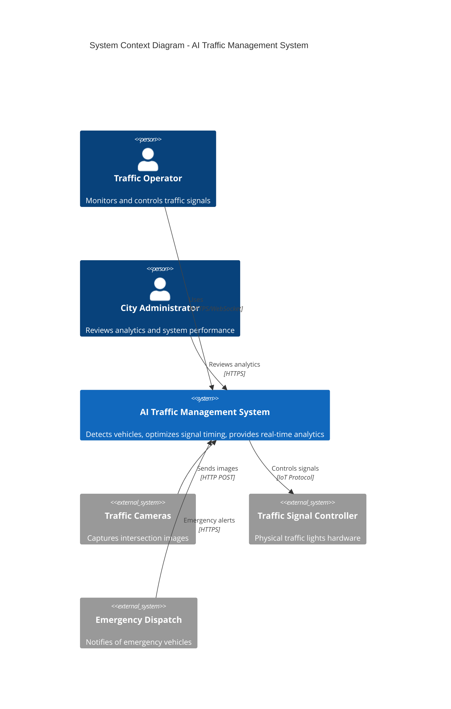
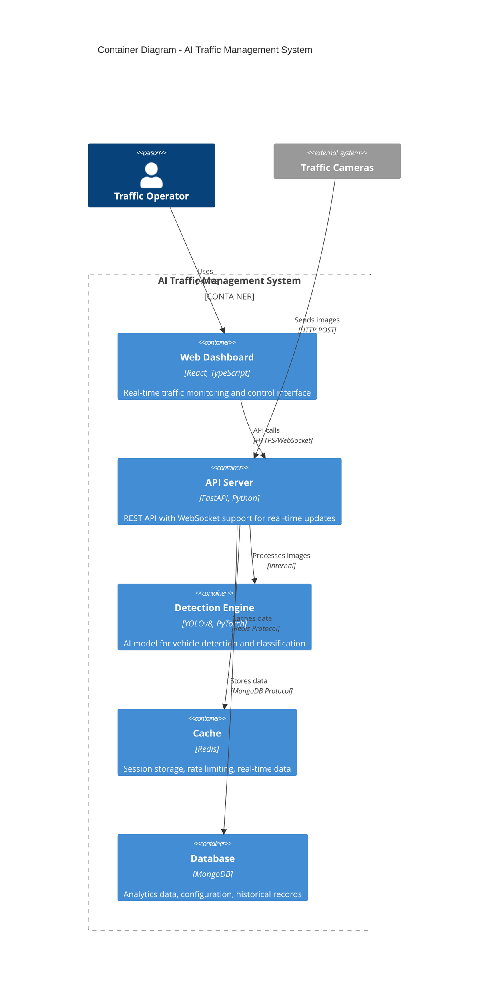
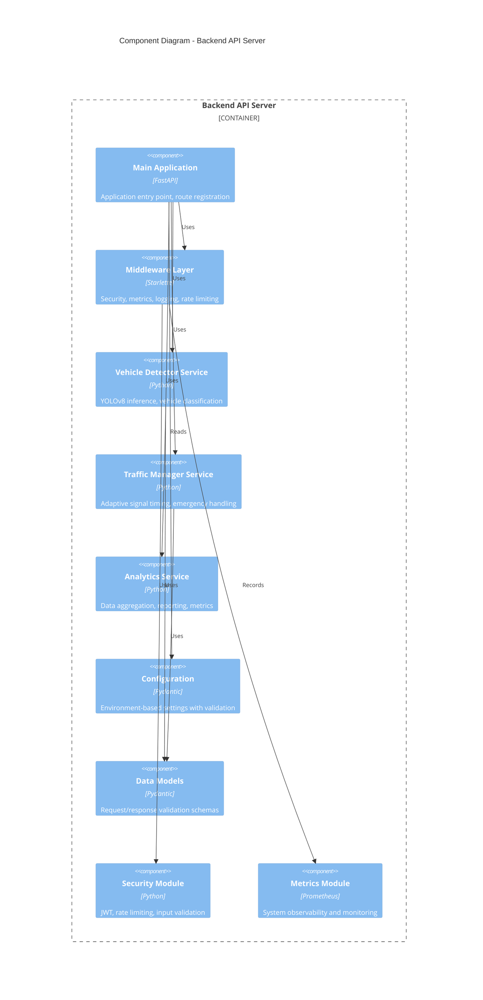

# AI Traffic Management System - Architecture

This document describes the software architecture of the AI Traffic Management System using C4 model diagrams.

## System Overview

The AI Traffic Management System is a modern, intelligent traffic control solution that uses computer vision and machine learning to optimize traffic flow at intersections.

## C4 Model Diagrams

### Level 1: System Context



### Level 2: Container Diagram



### Level 3: Component Diagram (Backend)



## Technology Stack

### Backend

| Layer          | Technology        | Purpose                              |
|----------------|-------------------|--------------------------------------|
| Web Framework  | FastAPI 0.104     | Async API with OpenAPI documentation |
| ML Framework   | PyTorch 2.0+      | Deep learning inference              |
| CV Model       | YOLOv8            | Real-time object detection           |
| Validation     | Pydantic 2.5      | Request/response validation          |
| Database       | MongoDB 7         | Document storage for analytics       |
| Cache          | Redis 7           | Session, rate limiting, real-time    |
| Metrics        | Prometheus        | System observability                 |
| Logging        | structlog         | Structured logging                   |

### Frontend

| Layer          | Technology        | Purpose                              |
|----------------|-------------------|--------------------------------------|
| Framework      | React 18          | UI components                        |
| Build Tool     | Vite 4            | Fast development and building        |
| Language       | TypeScript 5      | Type-safe JavaScript                 |
| Styling        | TailwindCSS 3     | Utility-first CSS                    |
| Charts         | Chart.js          | Data visualization                   |
| Real-time      | Socket.io         | WebSocket communication              |

## Data Flow

### Vehicle Detection Flow

```
1. Camera captures intersection image
2. Image uploaded via POST /api/detect-vehicles
3. Image validated and preprocessed
4. YOLOv8 model performs inference
5. Detection results processed (bounding boxes, classification)
6. Lane assignment based on position
7. Results stored in analytics database
8. Traffic manager notified of vehicle counts
9. Signal timing optimized
10. Real-time update broadcast via WebSocket
```

### Emergency Override Flow

```
1. Emergency alert received via POST /api/emergency-override
2. Alert validated and prioritized
3. Current intersection status queried
4. Optimal clear path calculated
5. Signal states overridden for emergency lane
6. Override duration timer started
7. WebSocket broadcast to connected clients
8. Normal operation restored after timeout
```

## Deployment Architecture

```
┌─────────────────────────────────────────────────────────────────┐
│                         PRODUCTION                               │
├─────────────────────────────────────────────────────────────────┤
│                                                                  │
│  ┌──────────────┐    ┌──────────────┐    ┌──────────────┐       │
│  │   Vercel     │    │   Railway    │    │  MongoDB     │       │
│  │  (Frontend)  │───►│  (Backend)   │───►│   Atlas      │       │
│  │              │    │              │    │              │       │
│  └──────────────┘    └──────────────┘    └──────────────┘       │
│         │                   │                                    │
│         │                   ▼                                    │
│         │            ┌──────────────┐                           │
│         │            │    Redis     │                           │
│         │            │   Cloud      │                           │
│         │            └──────────────┘                           │
│         │                                                        │
│         └──────────────────────────────────────────────────────►│
│                        WebSocket Connection                      │
│                                                                  │
└─────────────────────────────────────────────────────────────────┘
```

## Security Architecture

### Authentication Flow

```
1. User requests access token
2. Credentials validated
3. JWT token generated with expiration
4. Token included in Authorization header
5. Middleware validates token on each request
6. Rate limiting applied per client IP
7. Security headers added to responses
```

### Security Layers

| Layer              | Implementation                        |
|--------------------|---------------------------------------|
| Transport          | HTTPS/TLS 1.3                         |
| Authentication     | JWT tokens (HS256)                    |
| Authorization      | Role-based access control             |
| Input Validation   | Pydantic models                       |
| Rate Limiting      | Token bucket algorithm                |
| CORS               | Configured allowed origins            |
| Security Headers   | X-Frame-Options, CSP, etc.            |

## Scalability Considerations

### Horizontal Scaling

- Stateless API design enables multiple backend instances
- Redis for shared session and rate limit state
- MongoDB replica set for database scaling
- CDN for static frontend assets

### Performance Optimizations

- YOLOv8n model (nano) for fast inference
- Async/await throughout backend
- Redis caching for frequent queries
- Connection pooling for database
- Response compression

## Monitoring and Observability

### Metrics Collected

- HTTP request latency (histogram)
- Request throughput (counter)
- Error rates by type (counter)
- Model inference time (histogram)
- Active WebSocket connections (gauge)
- System resources (CPU, memory)

### Health Checks

- `/health` - Comprehensive system health
- `/healthz` - Kubernetes liveness probe
- `/ready` - Kubernetes readiness probe

## Future Architecture Considerations

1. **Multi-intersection support**: Message queue for cross-intersection coordination
2. **Edge deployment**: Lightweight inference at camera locations
3. **ML Pipeline**: MLOps for model retraining and deployment
4. **Event sourcing**: Complete audit trail of signal changes
